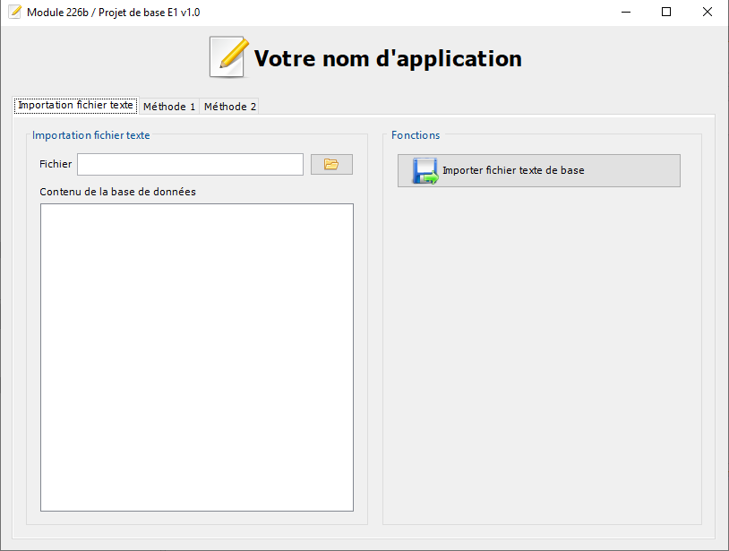
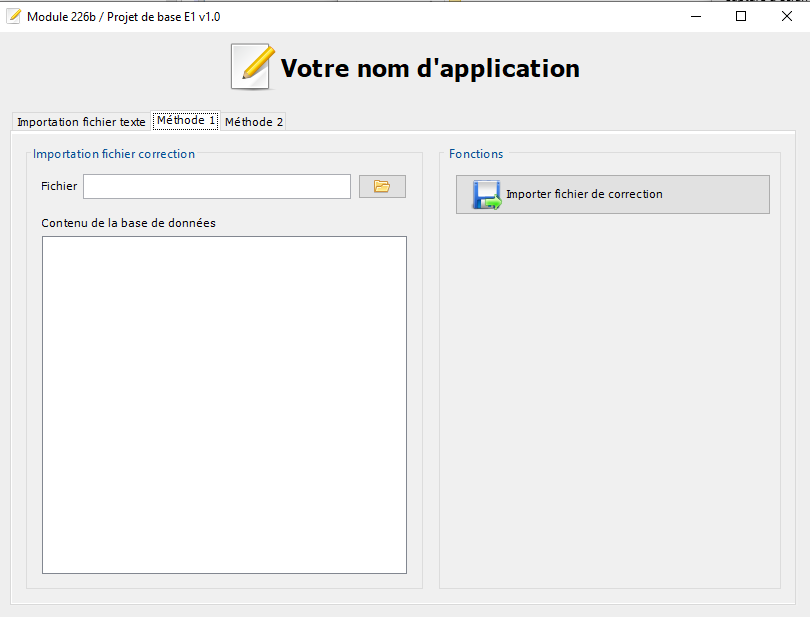
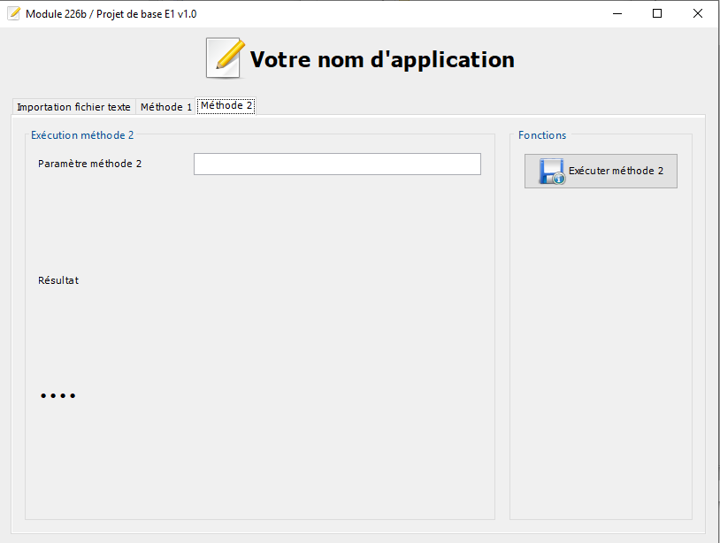
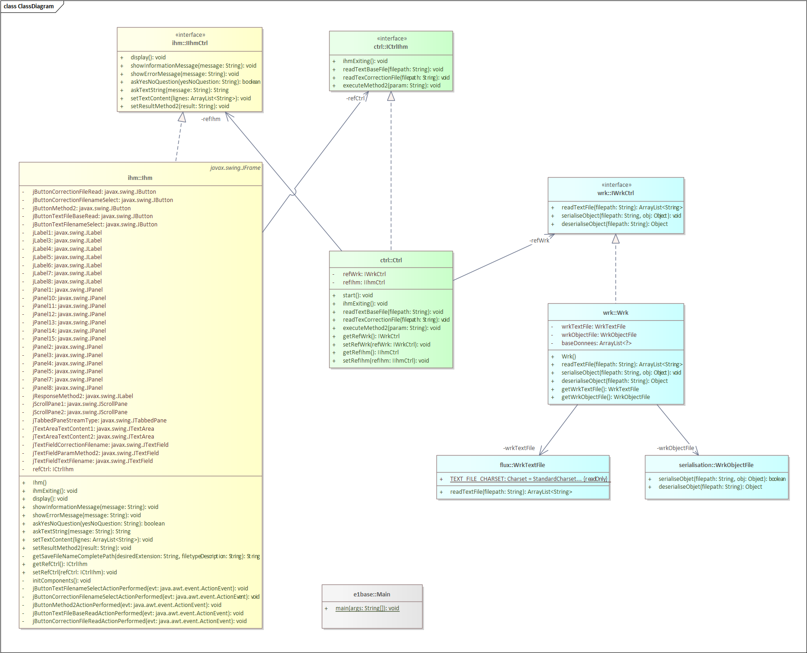

# Repository de base pour l'E1

## Introduction
Le projet `Base E1` est un projet qui vous permettra de réaliser votre 
« Evaluation 1 » avec toutes les fonctionnalités demandées par rapport à votre consigne :
- des flux texte (avec la lecture, l’écriture et le rajout de texte dans des fichiers)
- de la sérialisation et désérialisation de tous types d’objets Java
- de la réalisation de javadoc pour les deux méthodes de votre mandat
- de la conception des tests unitaires pour les deux méthodes de votre mandat
 
Le projet qui vous est donné est réalisé uniquement au niveau de l'interface utilisateur. Vous devez compléter le code du Contrôler et des Workers et rajouter les beans nécessaires pour votre projet.
 
## Interface utilisateur
L’ihm est composée de 3 onglets permettant d’accéder à des fonctionnalités propres :
Le premier onglet permet d'importer le fichier texte de base


Le second onglet permet d'exéuter la deuxième méthode et d'importer le fichier de correction.


Et pour terminer le troisième et dernier onglet permet d'exécuter la troisième méthode.


## Diagramme de classe
Le diagramme de classe du projet de base est le suivant :


## Worker
Dans le worker vous trouverez votre base de données permettant de stockar les données de votre application :

```
    /**
     * Votre base de données de votre objet
     */
    private ArrayList<?> baseDonnees;
```
 
## Travail à réaliser
- Créer vos beans nécessaires pour la réalisation de votre projet
- Implémentez les méthodes du Worker et du Contrôleur pour effectuer les 3 opérations demandées dans votre mandat
- Testez soigneusement l’application afin de vérifier que son comportement soit bien celui souhaité 